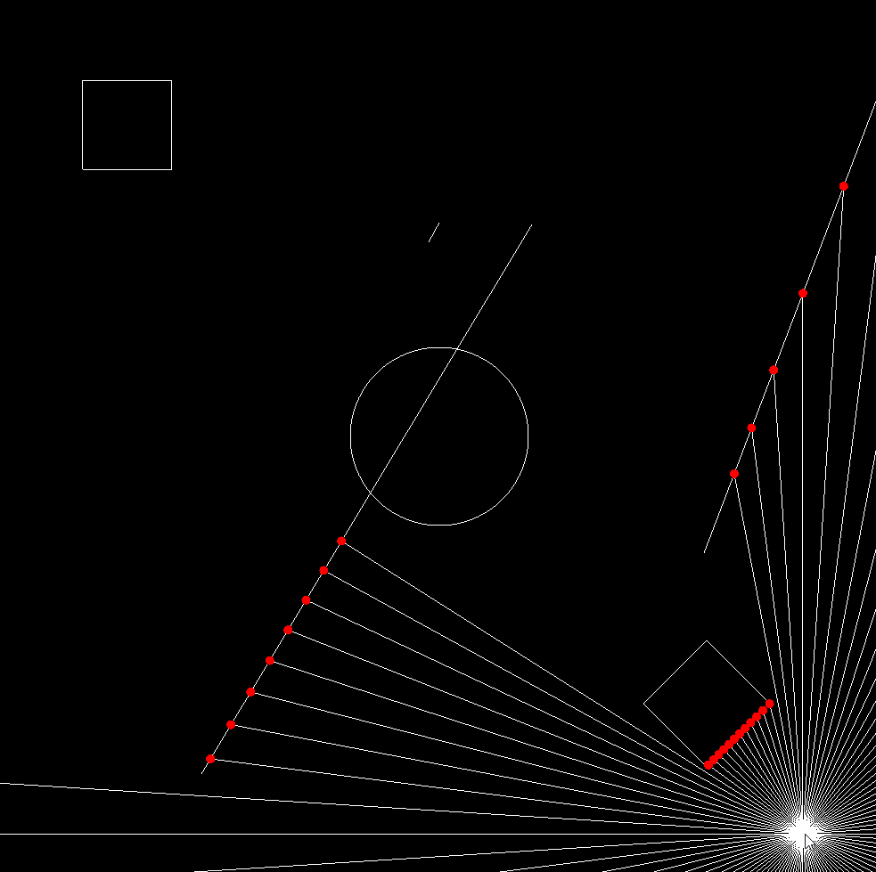

# 2D Raycasting

This project is a simple C++ application that utilizes the SFML library for 2D raycasting. It supports collision detection for custom polygons, lines, rectangles, and spheres.

  

## Features

- 2D raycasting with SFML
- Collision detection for custom polygons, lines, rectangles, and spheres

## How to Use

1. Ensure you have the SFML library installed and set up in your C++ development environment.
2. Clone this repository.
3. Open the project in your preferred C++ IDE.
4. Build and compile the project.
5. Run the executable file.
6. Move the mouse, and the emitter will move accordingly.

## License

This project is licensed under the [MIT License](LICENSE). Feel free to modify and distribute it according to the terms of the license.